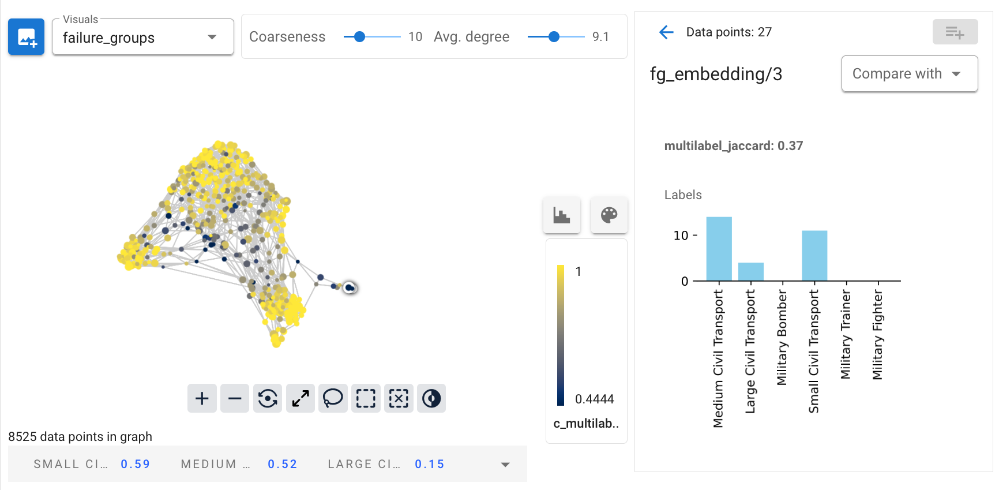

# BlueLightAI

Welcome to BlueLightAI's GitHub! We build tools to help AI developers
understand and improve their models and datasets. 

## Cobalt

With a straightforward Python API, BluelightAI Cobalt illuminates training data, model errors, and embeddings:

- Easily start analysis for a model or dataset with a few lines of code. Cobalt readily
  supports text, image, and tabular datasets.
  
  

- Automatically identify problematic groups of data in your model, saving days
  or weeks of data scientist troubleshooting effort.
- Use the groups discovered by Cobalt to target the most important data for
  retraining or fine-tuning, and create test cases to catch future regressions.
  

### Get Cobalt

Visit [our website](https://bluelightai.com/download-1) to request access to Cobalt and see more information.

## Community

- <https://bluelightai.com>

- [LinkedIn](https://www.linkedin.com/company/bluelightai/)

- [YouTube](https://www.youtube.com/@bluelightai-il6mc)
